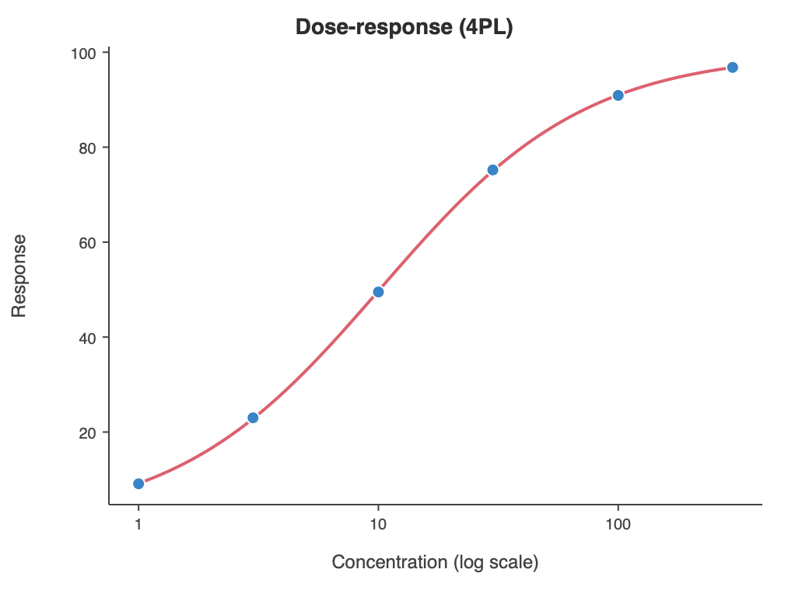
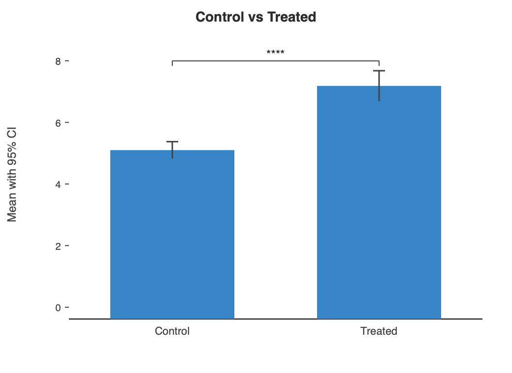

# BenchGraph Documentation

BenchGraph turns pasted experimental data into validated statistics and
publication-quality figures — no code required. A few outputs, generated
straight from the engine:

## Using BenchGraph

- [Getting started](./guide/getting-started.md): the whole loop once — get data in, pick an analysis, read the result, shape the figure, export it.
- [Choosing an analysis](./guide/choosing-an-analysis.md): which test suits which design, the two table shapes, and the ones people get wrong.
- [Multi-panel figures](./guide/multi-panel-figures.md): capture charts as lettered panels, reorder them by dragging, and export them as one figure.
- [Exporting and provenance](./guide/exporting-and-provenance.md): formats, the manifest written beside every figure, and project files.

## Documents

- [Project spec](./project-spec.md): system architecture and the design decisions behind the engine, CLI, app, and project-file format.
- [Market research](./research/market-research.md): GraphPad Prism and adjacent scientific stats/plotting alternatives.
- [Prism analysis templates](./research/prism-analysis-templates.md): internal reference cataloging the analyses Prism exposes, used to scope our validated subset and its ordering.
- [MVP and roadmap](./product/mvp-roadmap.md): first product shape, staged roadmap, workflows, and risks for a macOS DMG app.

## Notes

- Source-check dates vary by document and are noted at the top of each research/reference page.
- These docs began as research and product planning; the project now also has an implemented engine, CLI, and SwiftUI app. See the roadmap's [Implementation Status](./product/mvp-roadmap.md#implementation-status) for what's built.
