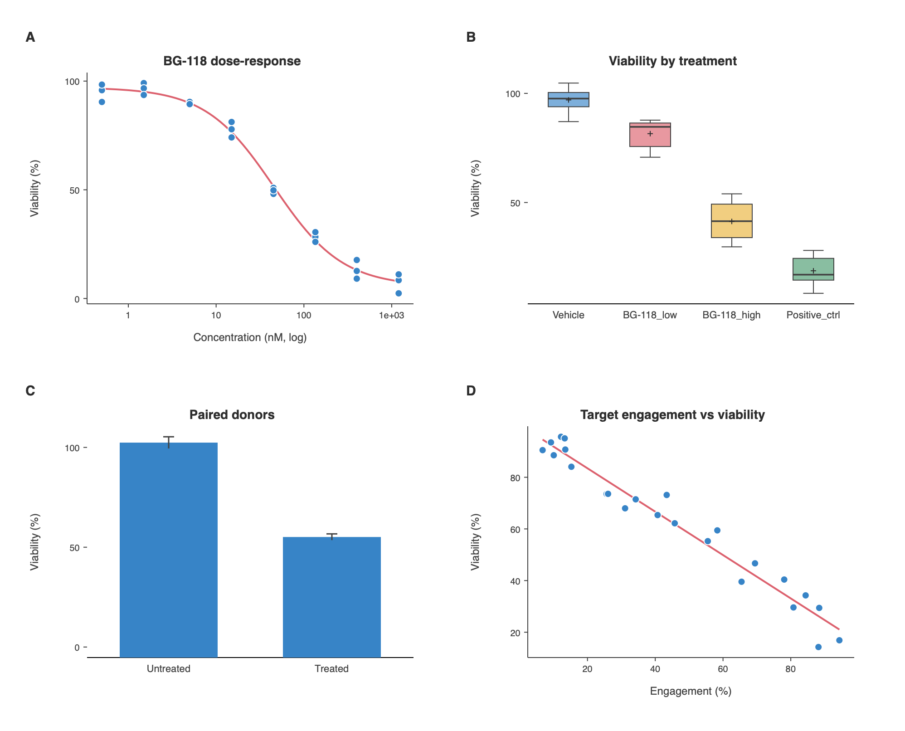

# Multi-Panel Figures

A journal figure is usually several charts lettered A, B, C, D. BenchGraph
builds one by **capturing charts one at a time**: get a chart looking right,
capture it as a panel, then change the data or the analysis and capture the
next.

Panels can come from completely different datasets. The figure above was built
from four separate files.

## Where to find it

The **Multi-panel figure** section is at the bottom of the left pane, below the
data grid and its buttons. You may need to scroll down to it.

## Building a figure

1. **Build a chart as usual** — load data, pick an analysis, set the plot style
   and theme.
2. **Press Add current chart.** A thumbnail of exactly what you captured appears
   in the tray, lettered **A**.
3. **Load the next dataset**, pick its analysis, and press **Add current chart**
   again. That one becomes **B**.
4. **Repeat** for as many panels as you need. Letters run A–Z and then AA, AB…
5. **Press Export panels…** to write the combined figure.

A captured panel is a **snapshot**. Changing the grid afterwards does not alter
a panel you already staged — that is what lets you build one figure from several
datasets.

## Reordering

Panel letters follow position, so rearranging the cards relabels them.

- **Drag a card** sideways and drop it on the position you want. Drop it on the
  first card and it becomes A.
- **Right-click a card** for **Move left** / **Move right** if you prefer not to
  drag.
- **Press ×** on a card to remove just that panel.

⌘Z undoes any of these, including **Clear**.

## Grid width

With two or more panels a **Columns** stepper appears. Set it to 1 for a single
column, 2 for the usual 2×2, up to 4. The summary line reads back the result,
e.g. *"4 panels · 2×2 grid"*.

## Which export button

There are two, and they do different things:

| Button | Where | What it writes |
| --- | --- | --- |
| **Export chart…** | Toolbar, top right | Only the single chart currently on screen |
| **Export panels…** | In the Multi-panel section | All staged panels, composed and lettered |

If you have staged panels and want the combined figure, use **Export panels…**.

## Saving

Staged panels are saved into the `.benchgraph` project along with your data and
options, so a part-built figure survives quitting the app. Panels are stored
**exactly as they were drawn**, so reopening a project will not silently redraw
a figure you may already have published.

## Try it with the demo dataset

The repository ships a synthetic four-file study designed for exactly this
workflow — each file drives a different panel type, with the ground truth
documented so you can check the analyses recover it:

[examples/multipanel](https://github.com/stacyshcherbakova/benchgraph/tree/main/examples/multipanel)

| File | Analysis | Gives you |
| --- | --- | --- |
| `A-dose-response.csv` | 4PL dose-response | Sigmoid curve on a log axis |
| `B-treatment-groups.csv` | ANOVA post-hoc | Box plot with significance brackets |
| `C-paired-donors.csv` | Paired t test | Bars ± SEM |
| `D-engagement-vs-viability.csv` | Linear regression | Scatter with a fit line |

There is also `B-treatment-groups.xlsx` — the same data as a workbook, for
trying the XLSX importer.
